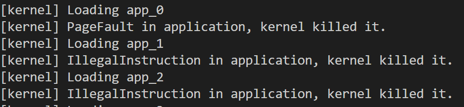

# 实现功能
## syscall计数
1. 在`task.rs`中, 为每个TCB块都加入一个计数数据结构, 静态分配了16个调用号到计数的可选映射
2. 在任务管理器中封装了增加和查询计数的接口
3. `syscall`函数开始时, 调用增加计数接口
4. `sys_trace`的分支为2时, 调用查询计数接口

## 读写特定内存
直接用unsafe指针操作完成

# 简答题
## 1.

- `bad_address` 访问地址0, 触发pagefault, handler直接退出并运行下一个任务
- `bad_instructions` 使用S态指令, 触发保护异常, handler直接退出并运行下一个任务
- `bad_register` 访问S态寄存器, 触发保护异常, handler直接退出并运行下一个任务
- RustSBI-QEMU Version 0.2.0-alpha.2

## 2.
1. sp指向内核栈, 当前环境压入的帧的起始位置. 运行第一个任务, 和上下文切换
2. `sstatus`: 状态寄存器, 尤其包括特权位  
   `sepc`: trap后要返回的程序位置  
   `sscratch`: 用户栈顶
3. x2是栈指针sp, 不跳过很显然会使得后面的栈上访存和ret不能正确运作  
   x4是线程指针tp, `_alltraps`中还没有设置它
4. sp指向了用户栈, 而sscratch指向了内核栈
5. sret, 从`sstatus`取出记录的特权级标记并恢复, 从而进入用户态
6. sp指向了内核栈, 而sscratch指向了用户栈
7. 触发trap的指令, 使得硬件切换到S态并跳转到__alltraps